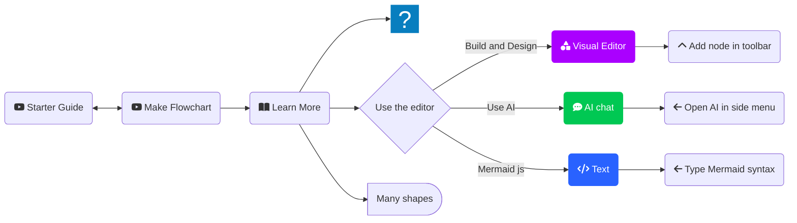
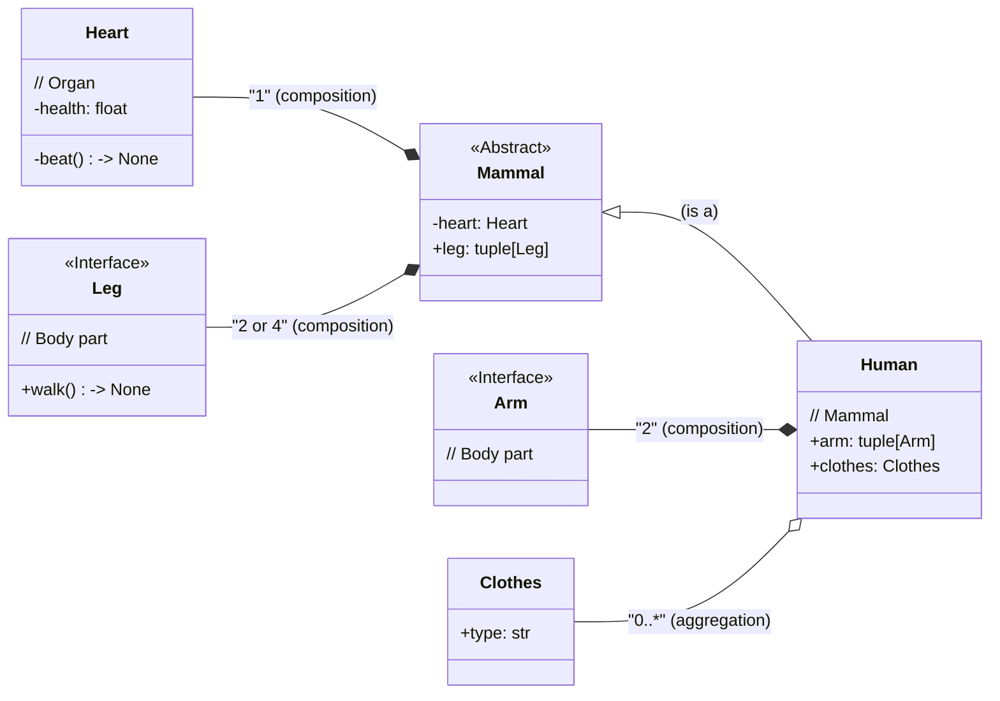

<!-- ============================================================== -->
<!-- == Header ==================================================== -->
<div align="center">

<!-- --- Title ---------------------------------------------------- -->

# `buildben`: build-benedictions

*Part of:*
<!-- --- Logo ----------------------------------------------------- -->
<a href="https://hisqu.de" target="_blank">
  
</a>

<br>

<!-- --- Badges --------------------------------------------------- -->

[](https://github.com/psf/black)

</div>

<!-- ============================================================== -->
<!-- == Abstract ================================================== -->
<div style="width: 85%; margin: 2rem auto; text-align: justify;">
<hr>

<blockquote> <i> A <b> benediction </b>(Latin: bene, 'well' + dicere, 'to speak') is a short invocation for divine help, blessing and guidance, usually at the end of worship service. </i> <sup> <a href="https://en.wikipedia.org/wiki/Benediction"> Wikipedia </a></sup> </blockquote>


#### `buildben` ...
<!-- Summarize the top 3 features -->
- ... = a Python development tool.
- ... standardizes project & experiment setups with template scaffolds
- ... integrates popular tools like `pipx`, `direnv`, `just`, etc.
- ... dockerizes a snapshot of your project for 100 % reproducibibility of experiments


#### Main dependencies:
<!-- List your main dependencies here and explain why they're important. -->
- **[`pipx`](https://pipx.pypa.io)**: The recommended home for `buildben`, making it accessible globally while keeping the OS-Python clean
- **[`pip-tools`](https://github.com/jazzband/pip-tools)**: Used to re-compute the venv requirements and sync them.
- **[`direnv`](https://direnv.net/)**: Auto-loads project-specific environment and provides  one-liners for environment management.
- **[`just`](https://github.com/casey/just)**: For running tasks to manage build tools & the virtual environment.
- **`Docker`:** Used to create snapshots of your project (optional). 


<hr>
</div>
  


<div align="center">


  
  <p><em> 
  <b> Graphical Abstract: </b>
  Management of Virtual Environments & Dependencies
  </em></p>
</div>

<br>

### Table of Contents

<!-- toc -->

1. [📦 Installation](#-installation)
2. [🚀 Usage](#-usage)
3. [❓Optional Installs](#optional-installs)
4. [📚  Examples / Documentation](#--examples--documentation)

<!-- tocstop -->
<!-- /toc -->

<br>

<!-- ============================================================== -->
<!-- == Installation ============================================== -->
## 📦 Installation

### Prerequisites:
- Python installed on your OS (and you know its executable in your `$PATH`)
- A Package manager (`apt`, `brew`, `winget`, etc.)

### 🏃Quick & Dirty:
```bash
git clone https://github.com/markur4/buildben.git
pip install -e buildben    # venv recommended
```

### 🏗️ Full Install (recommended): 

#### 1. Install [`pipx`](https://pipx.pypa.io/stable/installation/):
To use `buildben`  globally and to keep the OS-python clean, we recommend `pipx`.
```bash
sudo apt install pipx        # For Ubuntu
# brew install pipx          # For MacOS
# py -m pip install --user pipx   # For Windows (Not tested!)
pipx ensurepath                   # Add pipx to PATH, if not already done
pipx upgrade-all                  # !! Never run pipx with sudo !!
```

#### 2. Clone & install `buildben`:
```bash
git clone https://github.com/markur4/buildben.git
cd buildben         # Needed, `pipx install buildben` does NOT work!
pipx install -e .   # Editable for direct modifications.
```

#### 3. Install [`just`](https://github.com/casey/just):
```bash
sudo apt install just     # For Ubuntu
# brew install just       # For MacOS
# pipx install rust-just  # Windows requires the cross-platform version (not tested!)
```


#### 4. Install [`direnv`](https://direnv.net/) & hook it into your shell: 
   - *Either* follow the instructions for [install](https://direnv.net/docs/installation.html) & [hook](https://direnv.net/docs/hook.html),
   - *Or* run `src/buildben/setup_zsh.sh` to install both `zsh` & other useful plugins, including `direnv`.

```bash
# === Example for Ubuntu + zsh =============
sudo apt install direnv
# Add direnv plugin (or just the hook) if missing
RCFILE="${ZDOTDIR:-$HOME}/.zshrc" # Respect ZDOTDIR if user set it
if ! grep -q 'direnv ' "$RCFILE"; then
    sed -i 's/^plugins=(/plugins=(direnv /' "$RCFILE"
fi
```


### ✅ Verify installation:
```bash
bube        # Prints help when no args are given
# buildben  # Alias for bube
```

<br>


<!-- ============================================================== -->
<!-- == Usage ===================================================== -->
## 🚀 Usage

### Projects
```bash
# Initialize project scaffold:
bube init-proj \   # Long Alias for `bube proj`
  -n my_project \  # Project name = Name of new project folder
  -t . \           # Parent directory to place new project folder into
  -u your_github_username
  -g               # Initializes git repo and commits scaffold
```

#### Create virtual environment (``/.direnv``):

```bash
cd <my_project_name> # Changing directory will auto-create the venv
# ==> You will be prompted to allow the direnv to activate!
# direnv allow
```

#### Install dependencies & create ``(dev-)requirements.txt`` :
```bash
just install-compile  # Executes `pip-compile` & `pip-sync` from pip-tools
# just insco          # Alias for `install-compile`
```
<details> <summary> What's pip-compile? </summary>

  - ``just`` auto-navigates to the directory of the justfile (project root).
  - **`pip-compile`:** 
    - Resolves environment defined by dependencies listed in `pyproject.toml`. 
    - Similair to `pip freeze`, this creates ``requirements.txt`` and ``dev-requirements.txt``, including all versions and sources.
  - **`pip-sync`:** Installs dependencies from ``requirements.txt`` and ``dev-requirements.txt``

</details>

#### List `just` recipes:
*Recipes* (=functions) are defined in the `justfile`. Edit them or add more as you like! 
```bash
just  # Alias for `just --list`. 
```

#### 'Uninstall' Project:
```bash
rm -rf ../my_project  # Simply delete the project folder
```

<hr>


### Experiments
Experiments are defined as scripts meant to use, test, validate, etc.
your current project. They will be collected inside the `experiments`
directory inside the project root, including templates for Reports, outputs, etc.!

```bash
# From inside your project:
bube init-exp -n experiment1 # Long Alias for `bube exp`
# > Creates the scaffold in `./experiments/2025-06-13_experiment1`
```

<hr>

### Snapshots
You can create a snapshot of your current project, sparing you the
headache of PyPI releases and semantic versioning. This is useful for
e.g. reproducing your experiment after the project has changed. It works by
capturing the current commit hash, pip-compiling requirements and creates a
Dockerfile + Docker-Image.
```bash
# From inside your project:
bube env-snapshot --target-dir experiments/2025-06-13_experiment1
# > Creates Dockerfile, experiment.env, etc. inside target-dir
```


<br>


<!-- ============================================================== -->
<!-- == Optionals ================================================= -->

## ❓Optional Installs

### Use `direnv` & `just` in VS Code:

#### Select Python Interpreter:
This needs to be repeated for every new workspace folder!
1. Press ``Ctrl + Shift + P``; search & select *"Python: Select Interpreter"*
2. It will list workspace folders. Select the one you want to assign the direnv-interpreter to.
3. It will list available interpreters `.direnv/python-3.x.y` should be next to the global ones (VS Code documentation claims it knows `direnv` out-of-the-box!).
4. If it does not appear, then try adding this to your ``settings.json`` & replace ``<path_to_your_projects>`` with the actual parent folder where you store your projects. It must be within your home directory, and VS Code must have permission to that folder!


```json
// Optional: Patterns inside the home directory that point to a parent folder containing a venv or python-3.x.y:
  "python.venvFolders": [ "user/<path_to_your_projects>/*/.direnv" ],
```
5. You might also try activating "python.terminal.activateEnvironment" in the VS Code settings.


#### Install VS Code Extensions:
```bash
code --install-extension mkhl.direnv 
code --install-extension nefrob.vscode-just
```

<br>

### [`Mermaid`](https://mermaid.js.org/) - For Quick & Dirty Diagrams

#### Install VS Code Extension:
```bash
code --install-extension vstirbu.vscode-mermaid-preview
```
``Mermaid`` runs natively in GitHub & Markdown-tools.


### [`PlantUML`](https://plantuml.com/) - For Big Figures

#### Install [`graphviz`](https://github.com/graphp/graphviz?tab=readme-ov-file#install) & Java (e.g. [`temurin`](https://adoptium.net/de/)):

```bash
sudo apt-get install temurin-21-jdk graphviz     # For Ubuntu
# brew install temurin graphviz                  # For MacOS
# winget install EclipseAdoptium.Temurin.21.JDK  # Windows 
# winget install -e --id Graphviz.Graphviz       # Windows
```
#### Install VS Code Extension:
```bash
code --install-extension jebbs.plantuml
```
<br>


<!-- ============================================================== -->
<!-- == Examples ================================================== -->


## 📚  Examples / Documentation 

### Diagrams

| **Feature**       | **``Mermaid``**                                         | **``PlantUML``**                                                   |
| ----------------- | --------------------------------------------------- | -------------------------------------------------------------- |
| **Ease of Use**   | 🟢 Simple, Markdown-like syntax; quick to learn and use  | 🟢  Easy to learn; DSL based on Graphviz’s DOT            |
| **Integration**   | 🟢 Native to GitHub and Markdown-tools, no extra installs      | 🟡  Requires `Java`+`Graphviz`; either install it or use their server |
| **Functionality** | 🔴 Limited styling and diagram types                     | 🟢 Extensive theming (`skinparam`, CSS); supports UML, BPMN, C4, etc.  |


#### `Mermaid`  flowchart (code inside `README.md`):



####  `Mermaid`  Class Diagram (code inside `README.md`):



