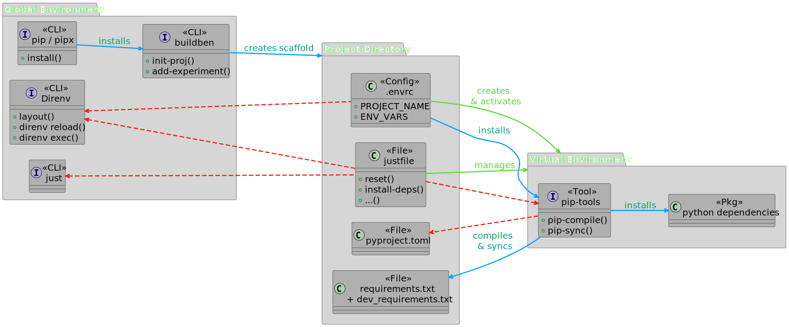

<center>

# Build-Benedictions 

# ``$ buildben init-proj`` 

## Managing Multiple (Python) Projects & Dependencies


<div class="speaker">
  <p class="author">Dr.&#8239rer.&#8239nat. Martin Kuric</p>
  <p class="affiliation">Academy of Sciences Göttingen · Germania Sacra / HisQu</p>
</div>

<!-- _paginate: skip -->
<!-- _footer: "" -->
<!-- _header: "" -->

</center>


---
## `buildben`: Main Commands
(`bube` is the alias for `buildben`)

- ``$ bube init-proj``: Create a new **project**. — ✅ *99% Done*
- ``$ bube add-experiment``: Add a new **experiment** to a project. — 🤞 *80% Done*
- ``$ bube env-snapshot``: Dockerize current project for reproducibility. — 🤞 *80% Done*
- ``$ bube init-database``: Create a new central **database**. — 🏗️ *60% Done*

---
<!-- ============================================================= -->
## Disclaimer

- ``buildben`` is very easy to use. (Goal is to make work simpler)
- This presentation is for python beginners.

#### But ...
- ... ``buildben``  solves **a lot** of *behind-the-scenes-problems* at once.
→ The logic behind ``buildben`` is **not beginner-friendly**.
- Some problems are hard to understand if you haven't encountered them yet...
(I myself don't understand them fully either, *I simply trust the best practices..!*)
- I'll give my best to explain  python standards and my personal decisions.
- If anything is unclear, please ask immediately! (But expect some *(un)organized chaos*...)


---
<!-- ============================================================= -->
## How This all Started:

- I had one big mono-repository containing multiple projects. It was a MESS. 
- After splitting into smaller repos: Managing multiple separate projects is painful, too..! 
  - "Let's just start developing, I can add a ``setup.py`` later!"
  - "When did I last update the ``requirements.txt`` / ``setup.py``?"
  - "When anyone tries to use this code, the setup will probably break..."
- I had scripts to automate tasks, all of them poorly documented & scattered across repos!
- I needed one centralized standard to solve **all** my problems:
  - Think ahead, avoid problems, read my mind, etc.
  - Minimal interaction: No more than 1 CLI-command to do 100 things at once.
  - (*like a quick prayer doing miracles ...🙏😇*)


---
<!-- ============================================================= -->
## From [Wikipedia]("https://en.wikipedia.org/wiki/Benediction"):

 

*"A **benediction** (Latin: bene, 'well' + dicere, 'to speak') is a short **invocation** for divine help, blessing and guidance [...]."*

*"**Invocation** is the act of calling upon a deity, spirit, or supernatural force, typically through prayer, ritual, or **spoken formula**, to seek guidance, assistance, or presence."*

<br>

<!-- _header: "" -->


---
<!-- ------------------------------------------------------------- -->
## My Projects before `buildben`: 

1. Make a virtual environment (``.venv``) for each project:
```bash
python -m venv ".venv"  # Prevents polluting your OS with project-related chaos
source .venv/bin/activate  # Activate virtual environment
```
2. Collect my dependencies in a ``"proj-requirements.txt"`` file.
3. `pip`: installs my dependencies and all *dependencies of dependencies*:
```bash
pip install -r "proj-requirements.txt"  # Resolve Environment & install dependencies
```
4. Compile all installed dependencies + versions for further reinstalls:
```bash
pip freeze > "requirements.txt"  # Compile list of dependencies installed in current .venv
```


---
<!-- ------------------------------------------------------------- -->


## `proj-requirements.txt`

- Manually created by me: Whenever I ``pip install`` a new package, I add it to this file.
- Used by `pip` to *"resolve the environment"* (= collect *dependencies of dependencies*)
  

```text
ipykernel
jupytext    # Convert .ipynb to .py
numpy
openpyxl    # For reading Excel files
pandas
matplotlib  
seaborn     # Better plotting
pytest
```

---
## `requirements.txt`

```bash
pip freeze > "requirements.txt"  # Compile list of dependencies installed in current .venv
```
  
```text
asttokens==3.0.0
build==1.2.2.post1
click==8.2.1
comm==0.2.2
debugpy==1.8.14
decorator==5.2.1
ipykernel==6.29.5
ipython==9.4.0
ipython_pygments_lexers==1.1.1
jedi==0.19.2
jupyter_client==8.6.3
jupyter_core==5.8.1
matplotlib-inline==0.1.7
# ... 
```

---
<!-- ------------------------------------------------------------- -->
## My Projects before `buildben`: Architecture


<center>

***"I will add a `pyproject.toml` once I need it!"***</center>

<center>

---
<!-- ------------------------------------------------------------- -->
## My Projects before `buildben`: Setup

```bash
git clone "<repo-url>"        # Download
cd "<repo-name>"             
python -m venv ".venv"        # Prevents polluting your OS with project-related chaos
source .venv/bin/activate     # Activate virtual environment
```


If there's only a ``"requirements.txt"``:
```bash
pip install -r "requirements.txt"   # Install only dependencies
```

If there's a ``pyproject.toml``:

```bash
pip install -e .                   # Editable install
```

---
### My Projects before `buildben`: **2 Main Problems**

<br>

#### 1. Dependencies are pinned by hand:
- ``requirements.txt`` must be manually updated.


#### 2. Imports rely on current working directory:
- ``requirements.txt`` only holds dependencies, not the **project structure**.
- Cannot import anything outside the current working directory (no ``import ../module``)
- VS Code (sometimes) struggles with **refactoring** & **typing** across packages.


---

#### Further Annoyances:

1. ``requirements.txt`` mixes runtime and development dependencies.
2. (De-)Activating ``.venv`` can be forgotten or annoying.
3. Too many CLI-commands to remember & type *(especially when working with 4 Repos at the same time)*.
4. How to properly write unit-tests mid-development..?
<br>


---

| Solution                        | Why beginners should care                        | Standard                                           |
| ------------------------------------- | ------------------------------------------------ | -------------------------------------------------- |
| `pyproject.toml`                      | Single file that stores metadata and tool config |  [PEP 621][1] |
| Editable install (`pip install -e .`) | Code changes are picked up without re-install    | [PEP 660][2] |
| `src/` layout                         | Forces you to test the installed package         | [PyPA guide][3] |
| `pip-tools`                           | Auto-generates (and syncs) `requirements*.txt`   | [Jazzband docs][4] |
| `direnv`                              | Activates the correct virtual env when you `cd`  | [direnv docs][5] |
| `just`                                | Saves “one-liners” like `just insco`             | [just README][6] |


[1]: https://peps.python.org/pep-0621/?utm_source=chatgpt.com "PEP 621 – Storing project metadata in pyproject.toml | peps.python.org"
[2]: https://peps.python.org/pep-0660/?utm_source=chatgpt.com "PEP 660 – Editable installs for pyproject.toml based builds (wheel ..."
[3]: https://packaging.python.org/en/latest/discussions/src-layout-vs-flat-layout/?utm_source=chatgpt.com "src layout vs flat layout - Python Packaging User Guide"
[4]: https://realpython.com/pypi-publish-python-package/?utm_source=chatgpt.com "How to Publish an Open-Source Python Package to PyPI"
[5]: https://direnv.net/?utm_source=chatgpt.com "direnv – unclutter your .profile | direnv"
[6]: https://github.com/casey/just?utm_source=chatgpt.com "casey/just: Just a command runner - GitHub"


---

===== ID-based evaluation =====
| Metric                       | Value   |
|------------------------------|---------|
| Hits Pos.-ctrl [total count] | 2602    |
| Hits AI [total count]        | 4372    |
| AI TP [count]                | 1038    |
| AI FP [count]                | 1105    |
| AI FN [count]                | 1566    |
| AI UNCLEAR [count]           | 662     |
| ERROR [count]                | 1       |
| AI precision [%]             | 48.4%   |
| AI recall [%]                | 39.9%   |

---
## Build-Benedictions: Minimal Workflow

```bash
bube proj    # Shorthand for `buildben init-proj`
```

---
<!-- ------------------------------------------------------------- -->
## Build-Benedictions: Improving **Setup & Maintenance**

#### **Standardize** with template scaffolds:
- ``$ bube init-proj``: Create a new **project** 

#### **Automate workflow** by integrating popular CLI-tools:
- ``direnv``: Automate virtual **environments** & variables.
- ``pip-tools``: Automate **dependency** management.
- ``just``: Summarize tasks into **one-liners**: `just install`, `just upgrade`, etc.
- ``docker``: **Snapshot** current state of project.


---
<!-- ------------------------------------------------------------- -->

## Without `buildben`: 


  
<!-- _footer: "" -->
<!-- _header: "" -->


---
<!-- ------------------------------------------------------------- -->

## With `buildben`:


<!-- _footer: "" -->
<!-- _header: "" -->

---
<!-- ------------------------------------------------------------- -->
## Project Directory: `src`-Layout 

```bash
# src layout (good)              # flat layout (risky)
myproject/                       myproject/
├── src/                         │    
│   └── myproject/               │
│       ├── main.py              ├── main.py             
│       └── package/module.py    ├── package/module.py
├── tests/                       ├── tests/
│   └── test_module.py           │   └── test_module.py
├── README.md                    ├── README.md
```
#### Benefits:
- Avoids imports from working directory via ``PYTHONPATH``
→ Forces tests to run on installed code: `pip install -e .` → Catches ``import`` bugs
- Builds **clean wheels**: Stray files never ship to PyPI
- Recommended by [Python Packaging Authority (PyPA)](https://packaging.python.org/en/latest/discussions/src-layout-vs-flat-layout/)

---
<!-- ------------------------------------------------------------- -->
## Project Directory: Inside `src`

```bash
myproject/
├── src/
│   └── myproject/            # Single directory, same name as project root (Recommended)  
│       ├── __init__.py       # Marks directory as package; runs on first import!
│       ├── main.py           # Optional CLI entry-point (wired in via pyproject.toml)
│       ├── sheesh.py         # >>> import myproject.sheesh
│       ├── clients/          # >>> import myproject.clients
│       │   ├── __init__.py   # Sub-package "clients"
│       │   ├── llm.py        # >>> import myproject.clients.llm
│       │   └── embedding.py  # >>> import myproject.clients.embedding
│       └── utils/            # >>> import myproject.utils
│           ├── __init__.py   # Sub-package "utils"
│           ├── cooltool.py   # >>> import myproject.utils.cooltool
│           └── module6.py    # >>> import myproject.utils.module6
```


---
<!-- ------------------------------------------------------------- -->
## Project Directory: Auxiliary Files in Project Root

```bash
myproject/
├── .venv/                 # Virtual environment (or .direnv!)
├── .env                   # Environment variables (& secrets)
├── .gitignore               
├── .git/                  # Repository metadata
├── src/
│   └── myproject/        # Separate source code from tests!
├── tests/
│   └── test_module1.py    # Tests for module1
├── justfile               # Development tasks
├── pyproject.toml         # Project metadata, Setup!
├── requirements.txt       # Dependencies
├── requirements-dev.txt   # Development dependencies
├── README.md
├── LICENSE
```


